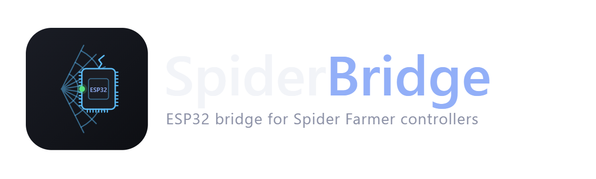
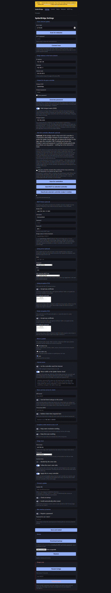
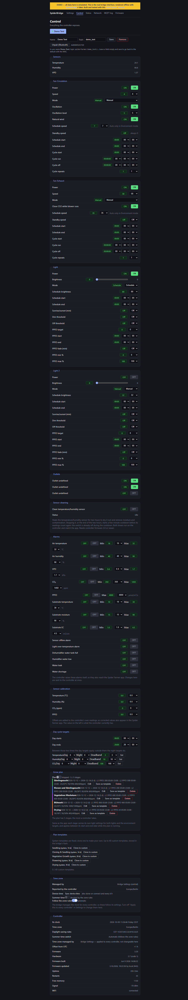
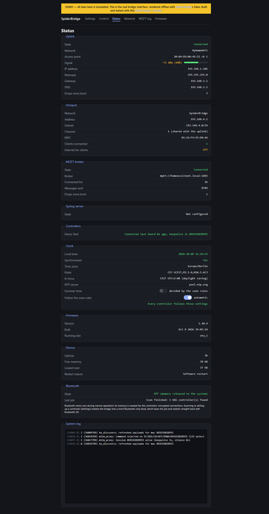
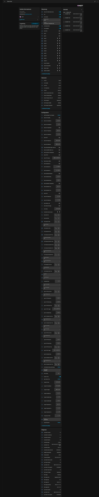
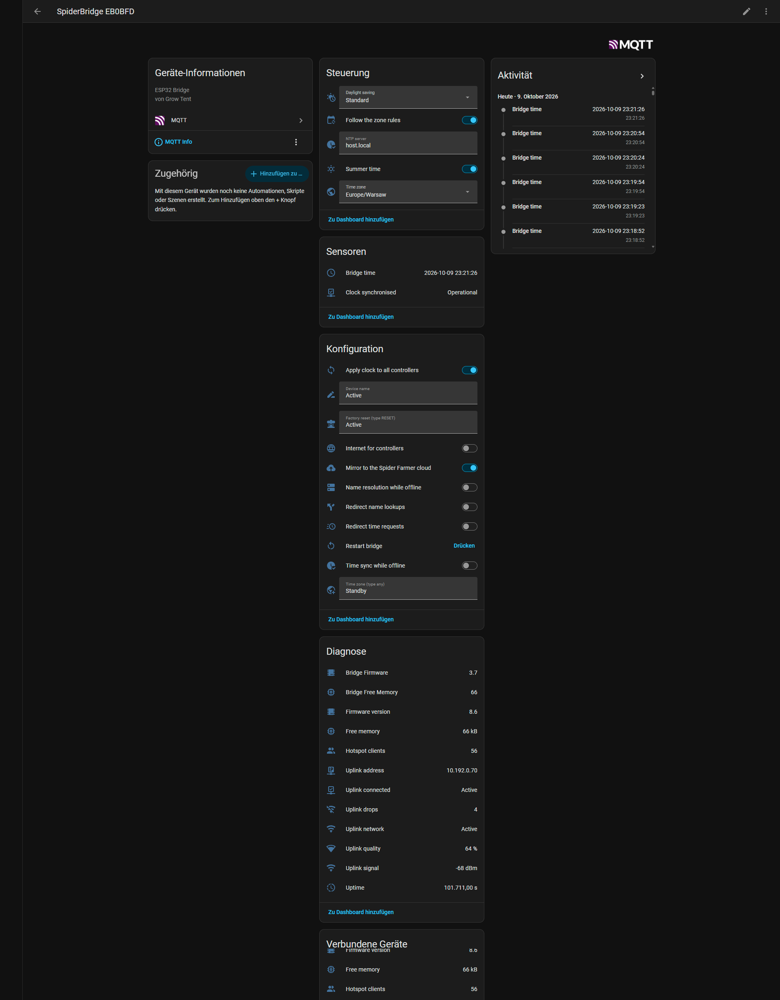
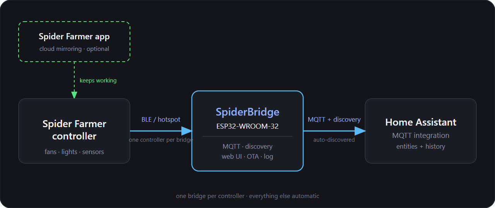
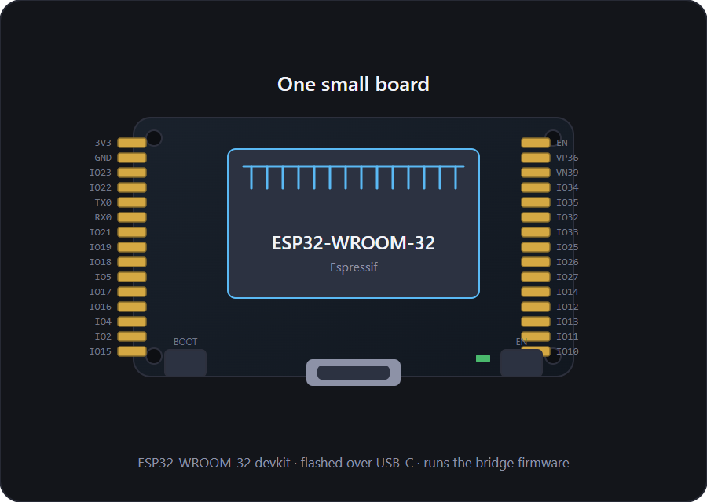

<p align="center">
  <a href="#"></a>
</p>

<p align="center">
  <strong>SpiderBridge — your Spider Farmer grow controller, native in Home&nbsp;Assistant.</strong><br>
  Flash once, pair once — every value and every setting of your GGS controller lives as a native Home Assistant entity. <b>No cloud. No app. No Raspberry Pi.</b>
</p>

<p align="center">
  <a href="https://matthias1232.github.io/spider-farmer-homeassistant/installer/"></a>
  &nbsp;
  <a href="https://matthias1232.github.io/spider-farmer-homeassistant/demo/"></a>
  &nbsp;
  <a href="https://github.com/matthias1232/spider-farmer-homeassistant/stargazers"></a>
</p>

<p align="center">
  
  
  
  
  
  
</p>

<p align="center">
  <a href="#-deutsche-version">🇩🇪 Deutsche Version ansehen</a>
</p>

---

## Why SpiderBridge?

Spider Farmer forces a cloud account, a vendor app, and routes your grow data through their servers. **SpiderBridge turns that around**: your controller talks only over Bluetooth to a ~€10 ESP32, and Home Assistant sees everything as if the controller were a native HA device.

| 🔒 **100% local** | 💸 **Under €15 setup** | 🧠 **1:1 with the app** |
|---|---|---|
| No Spider Farmer cloud, no app, no account. The controller's own internet can be switched off entirely. | One ESP32 (WROOM-32, 4 MB flash) is all you need. No Raspberry Pi, no Docker, no cable mess. | **183 HA entities** (153 per controller + 30 bridge diagnostics) — every light, fan, outlet, alarm and grow-plan setting is covered. |
| Controller ↔ Bridge: encrypted Bluetooth LE. Home Assistant ↔ Bridge: MQTT on your LAN. | Flash via a USB data cable, plug it in, done. No soldering, no terminal, no toolchain. | Day/night targets, 13 alarm types, grow plans with templates, sensor calibration, Bluetooth pairing — complete. |

---

## ⚡ Install in your browser — no terminal, no soldering

<p align="center">
  <a href="https://matthias1232.github.io/spider-farmer-homeassistant/installer/"></a>
</p>

**Four steps. That's it.**

1. 🌐 **Open the installer** → [matthias1232.github.io/spider-farmer-homeassistant/installer/](https://matthias1232.github.io/spider-farmer-homeassistant/installer/) (Chrome or Edge, desktop)
2. 🔌 **Plug in the board** → with a USB data cable, then click *Select board & start*
3. 📶 **Enter your Wi-Fi** → Improv Serial sends your home network credentials straight to the ESP32
4. 🔗 **(Optional) Quick Connect** → pairs your GGS controller over Bluetooth with the bridge hotspot

That's it. No command line, no `idf.py`, no YAML files. The ESP32 fetches the firmware straight from your browser, joins your Wi-Fi, and is reachable from then on at `http://spiderbridge.local`.

> 💡 **Tip:** If the flash fails with *Failed to initialize*, hold the **BOOT** button on the board while clicking *Install*, and release it as soon as the progress bar starts.

**Supported hardware:** Any ESP32 with **4 MB flash** (WROOM-32, WROVER, DevKitC, NodeMCU). Developed and tested with the
[QIQIAZI ESP32 NodeMCU Development Board (2-pack, USB-C)](https://www.amazon.de/dp/B0DHRV7784?&linkCode=ll2&tag=matthias1232-20&linkId=c71aee711cb280677528abe8e058e53c&ref_=as_li_ss_tl) — the affiliate link supports the project at no extra cost to you.

---

## What it does

- **Both lights** — on/off, brightness, Manual / Schedule / PPFD mode, fade time, dim & off threshold, PPFD target with min/max brightness
- **Both fans** — circulation and exhaust, all modes (Manual / Schedule / Cycle / Environment with temp/humidity priority), oscillation, natural wind, CO₂-closed-while-blower-runs
- **Climate accessories** — heater, humidifier, dehumidifier, individually switchable
- **10 outlets** of the power strips
- **Day/night cycle** — separate temperature, humidity and CO₂ targets plus deadband
- **13 alarm types** — air/substrate temperature & humidity, VPD, CO₂, PPFD, sensor offline, light over-temperature, dehumidifier tank, humidifier water, water leak, water shortage
- **Grow plans** — multi-stage plans from templates, stage labels with start/end, colors, reminders
- **Sensor calibration** — offsets for temperature, humidity, CO₂ and PPFD
- **Sensor cleaning** — with phase status, cool-down time and remaining time
- **Time & timezone** — automatic daylight saving per zone rules or manual, one-click sync to the controller
- **Bluetooth pairing** — pair/unpair button per controller
- **Live values** — air temperature/humidity, CO₂, VPD, PPFD, substrate temperature/humidity/EC, controller uptime, Wi-Fi signal, free memory
- **MQTT Discovery** — **183 native HA entities** with zero YAML configuration
- **Maintenance** — live log, syslog, backup/restore, OTA update, watchdogs + safe mode

<p align="center">
  <a href="docs/img/web/settings.png"></a>
  <a href="docs/img/web/control.png"></a>
  <a href="docs/img/web/status.png"></a>
</p>

---

## Quickstart in 3 steps

```
1️⃣  Flash    →  Open the installer, enter Wi-Fi, click "Install".
2️⃣  MQTT     →  Point the bridge at your broker (or use the Mosquitto add-on).
3️⃣  Pair     →  "Control → Bluetooth: scan" or the "Pair Bluetooth" button in HA.
```

The full step-by-step guide with troubleshooting lives below in the
[technical appendix](#technical-details-for-tinkerers).

---

## 🏠 Home Assistant — fully integrated

Each GGS controller shows up as its **own device with 153 entities** in Home Assistant, and the bridge adds **30 more diagnostic entities** (clock, timezone, network switches, uplink/hotspot diagnostics, restart, factory reset). All entities are native — use them in dashboards, automations, voice assistants, the energy dashboard and scenes without any YAML.

**GGS Controller — [controller-page.png](docs/img/ha/controller-page.png)** (all 153 entities in one capture):

<p align="center">
  <a href="docs/img/ha/controller-page.png"></a>
</p>

**SpiderBridge — [bridge-page.png](docs/img/ha/bridge-page.png)** (all 30 entities in one capture):

<p align="center">
  <a href="docs/img/ha/bridge-page.png"></a>
</p>

---

## How it works



<details>
<summary>Text diagram</summary>

```
┌────────────────────┐   Bluetooth LE    ┌───────────────────────────────┐
│  GGS Controller    │◄─────────────────►│  ESP32 "SpiderBridge"         │
│  (sensors, lights, │  encrypted GGS    │  • ggs_ble.c     BLE client   │
│   fans, outlets…)  │   protocol        │  • ha_mqtt.c     MQTT + HA    │
└────────────────────┘                   │  • Web UI (Settings, Control, │
                                         │    Status, Network, Log,      │
        ┌────────────────────────┐       │    Firmware)                  │
        │  Home Assistant        │       │  • MQTT Discovery, 183        │
        │  (auto-discovered      │◄──────│    entities                   │
        │   entities)            │ MQTT  └───────────────────────────────┘
        └────────────────────────┘
```

</details>

- **`ggs_ble.c`** — BLE client for the controller's GATT service (UUID `0x00FF`),
  encrypted GGS protocol, product-specific AES keys.
- **`sf_normalizer.c` / `sf_command_handler.c`** — translates controller frames into
  HA-friendly values and commands.
- **`ha_mqtt.c` + `ha_discovery_table.c`** — publishes state topics and
  discovery payloads so HA recognises the controller natively.
- **`mitm_proxy.c` + `wan_gate.c`** — optional path for controllers that connect to the
  bridge's Wi-Fi hotspot: the bridge terminates their TLS session locally and relays
  to the real Spider Farmer cloud. *Can be switched off entirely.*

---

## 🛡️ The bridge always comes back on its own

Pulling the power plug is **never** the way to restart it. Several independent layers each end in an automatic restart, and the USB console keeps answering throughout:

- **Hardware watchdogs** — task watchdog (8 s, both cores), interrupt watchdog (800 ms), bootloader watchdog
- **Supervisor** (`firmware/ggs/main/supervisor.c`) — core tasks report in regularly; hanging tasks or memory leaks (< 20 KB free heap for 90 s) trigger a restart
- **Boot-loop protection** — three restarts in a row without 2 minutes of healthy running start the **Safe Mode** (hotspot + Web UI + USB console only, no controller connect) — you can still reach, configure and flash it
- **Rollback on bad update** — the previous firmware image is restored if the new firmware does not boot
- **USB console never switches off** — after every flash, restart or crash it answers again

Tested on a real board with `python scripts/reboot_soak.py COM3 --mode fault` (crash, hang, watchdog, leak, safe mode) and `--mode command` (30× restart, ~11 s each, memory stable).

---

## ⭐ If this project helps you

- Give a **star** ⭐ — helps others find the repo.
- ☕ **[Donate via PayPal](https://www.paypal.com/paypalme/matthias1232)** — voluntary, the PayPal-me button in the sidebar points to the same account.
- 📦 **[Supported ESP32 board (Amazon)](https://www.amazon.de/dp/B0DHRV7784?&linkCode=ll2&tag=matthias1232-20&linkId=c71aee711cb280677528abe8e058e53c&ref_=as_li_ss_tl)**
  — affiliate link, no extra cost to you.

---

## Technical details (for tinkerers)

<details>
<summary><strong>Full installation guide (3 steps)</strong></summary>

### 1. Flash the firmware (Wi-Fi credentials included)

1. Open the [Web Installer](https://matthias1232.github.io/spider-farmer-homeassistant/installer/)
   in **Chrome or Edge** on a desktop and plug the board in with a USB *data* cable.
2. *Quick Connect* has two buttons with the same flow; only the flash step differs:
   - **"New board: install + set up"** installs the newest firmware (erasing the board first if
     ticked) and then sets it up.
   - **"Board already flashed: set up only"** flashes nothing. It restarts the board, checks that
     SpiderBridge runs, and then sets it up. Use it right after a flash, or for any bridge that
     has not met a controller yet.

   Enter your home Wi-Fi and click *Select board & start*; Chrome opens its serial-port list, you
   pick the board, and the wizard
   - joins your home Wi-Fi,
   - gives the bridge's hotspot a **new random password** (shown once at the end: write it down),
   - and, if the Bluetooth box is ticked, makes the bridge **search for your Spider Farmer GGS
     controller and connect it to the hotspot**. The controller stays visible over Bluetooth, so
     you can still pair your phone and use the Spider Farmer app afterwards. Only controllers
     heard clearly (stronger than -75 dBm) are touched, and the switch is used up after that one
     start.

   A bridge that is **already in use** (home network set and a controller known) deliberately does
   not listen for USB commands, because that memory is needed for the controller's connection.
   *Set up only* then says so and offers *Erase, install firmware and continue*; otherwise change
   Wi-Fi and the hotspot password in the bridge's Web UI. A board with older firmware, or with
   other firmware, gets an *Install firmware and continue* button instead.
3. **Already flashed, or want single steps:** click *Open installer & device tools*. The window it
   opens offers *Install*, *IP addresses & status*, *Send Wi-Fi to GGS Controller* (searches for
   your Spider Farmer controller over Bluetooth and sends it the bridge's hotspot Wi-Fi),
   *Home Wi-Fi for the bridge*, *Connect Wi-Fi & randomize SpiderBridge Wi-Fi password*,
   *Randomize SpiderBridge Wi-Fi password* and *Logs & Console*. (You can also join the
   `SpiderBridge` hotspot and configure Wi-Fi at `http://192.168.10.1`.)
4. Leave **Module** on *Auto-detect* (or pick your module, like the board list in Tasmota's installer).

> 💡 **Install fails with "Failed to initialize"?** Many ESP32 boards cannot enter download mode on
> their own. Hold the **BOOT** button while you press *Install* (or *Select board & start*) and
> release it when the progress bar starts.

The wizard's extra commands (IP addresses, hotspot password, quick connect) are SpiderBridge
extensions of [Improv Wi-Fi Serial](https://www.improv-wifi.com/serial/) (commands `0x40`–`0x46`,
see `firmware/ggs/main/improv_serial.c`); other Improv clients ignore them. The firmware side is
covered by a host test (`python firmware/ggs/host_test/run.py`) and the installer by
`node tests/installer_quickconnect.test.mjs` and `node tests/installer_console.test.mjs`; both run
in CI before the firmware is built.

The build the installer uses is always the latest successful build from this repository — you
can also build and flash any commit yourself (see *Build from source*).

*Auto-detect* reads the chip family from the connected board and installs the matching build.
The **Module** list only offers modules that were really built; today that is the classic
**ESP32** (WROOM-32 / WROVER / DevKitC / NodeMCU, 4 MB flash or more). ESP32-S2/S3/C3/C6 boards
are not supported yet, so the installer says so instead of flashing a wrong image.

### 2. Connect the bridge to Home Assistant

1. In Home Assistant: **Settings → Devices & services → MQTT** (install the Mosquitto add-on or
   point HA at your broker).
2. Enter your broker in the bridge's Web UI (Settings → MQTT) — or let the bridge run its own
   broker on the hotspot.
3. The bridge announces itself over MQTT Discovery; the diagnostics entities
   (bridge memory/firmware) appear immediately.

### 3. Pair the GGS controller (Bluetooth)

1. In the bridge's Web UI open **Control → Bluetooth: scan** (or press the *Pair Bluetooth* button
   in Home Assistant).
2. The bridge briefly restarts into Bluetooth-only mode, scans, and lists the controllers it found
   — with signal strength, product code and whether they are already known.
3. Select your controller. The bridge hands over the hotspot credentials, activates the device on
   the Bluetooth link and reboots straight back into normal operation.
4. A few seconds later the controller shows up in Home Assistant as its own device with the full
   set of entities.

**Done** — the Spider Farmer app was never opened.

> 💡 **Already using the Spider Farmer app?** You can keep it. Once after installation the
> controller's Wi-Fi is pointed at the bridge's hotspot — after that the app still reaches the
> controller through the bridge (and the controller's own cloud link can even be switched off
> entirely in the Web UI), while Home Assistant sees everything at the same time.

</details>

<details>
<summary><strong>Hardware recommendation</strong></summary>

The board the firmware was developed and tested with:

<p align="center"></p>

**→ [QIQIAZI ESP32 NodeMCU Development Board (2-pack, ESP32-WROOM-32, 4 MB, USB-C) — Amazon](https://www.amazon.de/dp/B0DHRV7784?&linkCode=ll2&tag=matthias1232-20&linkId=c71aee711cb280677528abe8e058e53c&ref_=as_li_ss_tl)**

Any other ESP32 board with 4 MB flash works as well. The affiliate link supports the project at
no extra cost to you.

Additionally required:

- **Spider Farmer GGS controller** with Bluetooth (all current models: CB / PS5 / PS10 / LC)
- **Home Assistant** with the MQTT integration (any broker, e.g. Mosquitto)
- The controller does **not** need Wi-Fi credentials or the Spider Farmer app — it is provisioned
  entirely over Bluetooth through the bridge

</details>

<details>
<summary><strong>All 183 HA entities</strong> — 153 per controller, 30 on the bridge (Control = writable, Sensor = read-only)</summary>

<!-- ENTITY-LIST:START -->
Grouped by function. *Kind*: Control = writable entity, Sensor = read-only.

| Entity | Platform | Kind | Unit |
|---|---|---|---|
| Fan | fan | Control | — |
| Fan Cycle Off Time | time | Control (config) | — |
| Fan Cycle Repeats | select | Control (config) | — |
| Fan Cycle Run Time | time | Control (config) | — |
| Fan Cycle Start Time | time | Control (config) | — |
| Fan Mode | select | Control | — |
| Fan Natural Wind | switch | Control | — |
| Fan Oscillation | fan | Control | — |
| Fan Schedule End Time | time | Control (config) | — |
| Fan Schedule Speed | select | Control (config) | — |
| Fan Schedule Start Time | time | Control (config) | — |
| Fan Speed | select | Control (config) | — |
| Fan Standby Speed | select | Control (config) | — |
| Close CO2 While Blower Runs | switch | Control | — |
| Fan Exhaust | fan | Control | — |
| Fan Exhaust Cycle Off Time | time | Control (config) | — |
| Fan Exhaust Cycle Repeats | select | Control (config) | — |
| Fan Exhaust Cycle Run Time | time | Control (config) | — |
| Fan Exhaust Cycle Start Time | time | Control (config) | — |
| Fan Exhaust Mode | select | Control | — |
| Fan Exhaust Schedule End Time | time | Control (config) | — |
| Fan Exhaust Schedule Speed | select | Control (config) | — |
| Fan Exhaust Schedule Start Time | time | Control (config) | — |
| Fan Exhaust Speed | select | Control (config) | — |
| Fan Exhaust Standby Speed | select | Control (config) | — |
| Light 1 | light | Control | — |
| Light 1 Dim Threshold | select | Control (config) | — |
| Light 1 Off Threshold | select | Control (config) | — |
| Light 1 PPFD End Time | time | Control (config) | — |
| Light 1 PPFD Fade Time | select | Control (config) | — |
| Light 1 PPFD Max Brightness | number | Control (config) | % |
| Light 1 PPFD Min Brightness | number | Control (config) | % |
| Light 1 PPFD Start Time | time | Control (config) | — |
| Light 1 PPFD Target | number | Control (config) | µmol/m²/s |
| Light 1 Schedule Brightness | number | Control (config) | % |
| Light 1 Schedule End Time | time | Control (config) | — |
| Light 1 Schedule Fade Time | select | Control (config) | — |
| Light 1 Schedule Start Time | time | Control (config) | — |
| Light 2 | light | Control | — |
| Light 2 Dim Threshold | select | Control (config) | — |
| Light 2 Off Threshold | select | Control (config) | — |
| Light 2 PPFD End Time | time | Control (config) | — |
| Light 2 PPFD Fade Time | select | Control (config) | — |
| Light 2 PPFD Max Brightness | number | Control (config) | % |
| Light 2 PPFD Min Brightness | number | Control (config) | % |
| Light 2 PPFD Start Time | time | Control (config) | — |
| Light 2 PPFD Target | number | Control (config) | µmol/m²/s |
| Light 2 Schedule Brightness | number | Control (config) | % |
| Light 2 Schedule End Time | time | Control (config) | — |
| Light 2 Schedule Fade Time | select | Control (config) | — |
| Light 2 Schedule Start Time | time | Control (config) | — |
| Day Cycle End | time | Control (config) | — |
| Day Cycle Start | time | Control (config) | — |
| Target CO2 Day | number | Control (config) | ppm |
| Target CO2 Deadband | number | Control (config) | ppm |
| Target CO2 Night | number | Control (config) | ppm |
| Target Humidity Day | number | Control (config) | % |
| Target Humidity Deadband | number | Control (config) | % |
| Target Humidity Night | number | Control (config) | % |
| Target Temperature Day | number | Control (config) | °C |
| Target Temperature Deadband | number | Control (config) | °C |
| Target Temperature Night | number | Control (config) | °C |
| Outlet 1 | switch | Control | — |
| Outlet 10 | switch | Control | — |
| Outlet 2 | switch | Control | — |
| Outlet 3 | switch | Control | — |
| Outlet 4 | switch | Control | — |
| Outlet 5 | switch | Control | — |
| Outlet 6 | switch | Control | — |
| Outlet 7 | switch | Control | — |
| Outlet 8 | switch | Control | — |
| Outlet 9 | switch | Control | — |
| Switch Dehumidifier | switch | Control | — |
| Switch Heater | switch | Control | — |
| Switch Humidifier | switch | Control | — |
| CO2 Offset | number | Control (config) | ppm |
| Humidity Offset | number | Control (config) | % |
| PPFD Offset | number | Control (config) | — |
| Temperature Offset | number | Control (config) | °C |
| Sensor Cleaning | switch | Control | — |
| Sensor Cleaning Phase Ends | sensor | Sensor | — |
| Sensor Cleaning Status | sensor | Sensor | — |
| Sensor Cleaning Time Left | sensor | Sensor | — |
| Alarm Air Humidity | switch | Control (config) | — |
| Alarm Air Humidity Maximum | number | Control (config) | % |
| Alarm Air Humidity Minimum | number | Control (config) | % |
| Alarm Air Temperature | switch | Control (config) | — |
| Alarm Air Temperature Maximum | number | Control (config) | °C |
| Alarm Air Temperature Minimum | number | Control (config) | °C |
| Alarm CO2 | switch | Control (config) | — |
| Alarm CO2 Maximum | number | Control (config) | ppm |
| Alarm CO2 Minimum | number | Control (config) | ppm |
| Alarm Dehumidifier Water Tank Full | switch | Control (config) | — |
| Alarm Humidifier Water Low | switch | Control (config) | — |
| Alarm Light Over-Temperature | switch | Control (config) | — |
| Alarm PPFD | switch | Control (config) | — |
| Alarm PPFD Maximum | number | Control (config) | µmol/m²/s |
| Alarm PPFD Minimum | number | Control (config) | µmol/m²/s |
| Alarm Sensor Offline | switch | Control (config) | — |
| Alarm Substrate EC | switch | Control (config) | — |
| Alarm Substrate EC Maximum | number | Control (config) | mS/cm |
| Alarm Substrate EC Minimum | number | Control (config) | mS/cm |
| Alarm Substrate Moisture | switch | Control (config) | — |
| Alarm Substrate Moisture Maximum | number | Control (config) | % |
| Alarm Substrate Moisture Minimum | number | Control (config) | % |
| Alarm Substrate Temperature | switch | Control (config) | — |
| Alarm Substrate Temperature Maximum | number | Control (config) | °C |
| Alarm Substrate Temperature Minimum | number | Control (config) | °C |
| Alarm VPD | switch | Control (config) | — |
| Alarm VPD Maximum | number | Control (config) | kPa |
| Alarm VPD Minimum | number | Control (config) | kPa |
| Alarm Water Leak | switch | Control (config) | — |
| Alarm Water Shortage | switch | Control (config) | — |
| Last Alarm Device (code) | sensor | Sensor (diagnostic) | — |
| Last Alarm Number | sensor | Sensor (diagnostic) | — |
| Last Alarm Time | sensor | Sensor (diagnostic) | — |
| Last Alarm Time (epoch) | sensor | Sensor (diagnostic) | — |
| Last Alarm Type (code) | sensor | Sensor (diagnostic) | — |
| Add Plan Stage From Template | button | Control (config) | — |
| Grow Plan | switch | Control | — |
| Plan Kept On Bridge | binary_sensor | Sensor (diagnostic) | — |
| Plan Stage | sensor | Sensor (diagnostic) | — |
| Plan Stage Color | sensor | Sensor (diagnostic) | — |
| Plan Stage Day | sensor | Sensor (diagnostic) | d |
| Plan Stage End | sensor | Sensor (diagnostic) | — |
| Plan Stage Reminder | sensor | Sensor (diagnostic) | — |
| Plan Stage Start | sensor | Sensor (diagnostic) | — |
| Plan Stages | sensor | Sensor (diagnostic) | — |
| Plan Template | select | Control (config) | — |
| Pair Bluetooth (stop advertising) | button | Control (config) | — |
| Unpair Bluetooth | button | Control (config) | — |
| Time Zone | text | Control (config) | — |
| Sync Device Time | button | Control (config) | — |
| Summer Time | switch | Control (config) | — |
| Controller Internet Access | switch | Control (config) | — |
| Air CO2 | sensor | Sensor | ppm |
| Air Humidity | sensor | Sensor | % |
| Air PPFD | sensor | Sensor | µmol/m²/s |
| Air Temperature | sensor | Sensor | °C |
| Air VPD | sensor | Sensor | kPa |
| Soil Average EC | sensor | Sensor | mS/cm |
| Soil Average Humidity | sensor | Sensor | % |
| Soil Average Temperature | sensor | Sensor | °C |
| Controller Firmware | sensor | Sensor (diagnostic) | — |
| Controller Free Memory | sensor | Sensor (diagnostic) | — |
| Controller Hardware | sensor | Sensor (diagnostic) | — |
| Controller Restarts | sensor | Sensor (diagnostic) | — |
| Controller Signal | sensor | Sensor (diagnostic) | dBm |
| Controller Time | sensor | Sensor (diagnostic) | — |
| Controller Uptime | sensor | Sensor (diagnostic) | — |
| Controller Uptime Seconds | sensor | Sensor (diagnostic) | s |
| Daylight Saving Rules | sensor | Sensor (diagnostic) | — |
| Firmware Built | sensor | Sensor (diagnostic) | — |
| Firmware Updated | sensor | Sensor (diagnostic) | — |
| Apply clock to all controllers | switch | Control (config) | — |
| Bridge time | sensor | Sensor | — |
| Clock synchronised | binary_sensor | Sensor | — |
| Daylight saving | select | Control | — |
| Follow the zone rules | switch | Control | — |
| NTP server | text | Control | — |
| Redirect time requests | switch | Control (config) | — |
| Summer time | switch | Control | — |
| Time sync while offline | switch | Control (config) | — |
| Time zone | select | Control | — |
| Time zone (type any) | text | Control (config) | — |
| Internet for controllers | switch | Control (config) | — |
| Mirror to the Spider Farmer cloud | switch | Control (config) | — |
| Name resolution while offline | switch | Control (config) | — |
| Redirect name lookups | switch | Control (config) | — |
| Hotspot clients | sensor | Sensor (diagnostic) | — |
| Uplink address | sensor | Sensor (diagnostic) | — |
| Uplink connected | binary_sensor | Sensor (diagnostic) | — |
| Uplink drops | sensor | Sensor (diagnostic) | — |
| Uplink network | sensor | Sensor (diagnostic) | — |
| Uplink quality | sensor | Sensor (diagnostic) | % |
| Uplink signal | sensor | Sensor (diagnostic) | dBm |
| Bridge Firmware | sensor | Sensor (diagnostic) | — |
| Bridge Free Memory | sensor | Sensor (diagnostic) | — |
| Firmware version | sensor | Sensor (diagnostic) | — |
| Free memory | sensor | Sensor (diagnostic) | kB |
| Uptime | sensor | Sensor (diagnostic) | s |
| Device name | text | Control (config) | — |
| Factory reset (type RESET) | text | Control (config) | — |
| Restart bridge | button | Control (config) | — |

**183 entities in total** — 153 per controller + 30 on the bridge (binary_sensor × 3, button × 5, fan × 3, light × 2, number × 36, select × 21, sensor × 46, switch × 42, text × 5, time × 20). Generated from the firmware (`ha_discovery_table.c` and `ha_mqtt.c`) by `scripts/gen_entity_docs.py`; do not edit by hand.
<!-- ENTITY-LIST:END -->
</details>

<details>
<summary><strong>Build from source</strong></summary>

The repository is laid out for one directory per supported controller family, so more firmwares
can be added later. `firmware.json` describes what exists; every listed target is built by CI and
shows up in the installer's **Module** list:

```json
[
  { "id": "ggs", "dir": "firmware/ggs", "targets": ["esp32"],
    "modules": { "esp32": { "label": "ESP32 (WROOM-32 / WROVER / DevKitC / NodeMCU)" } } }
]
```

**GitHub Actions** (this repository) generates the flashable builds — after *every* code change,
immediately:

- push to `main` → build + publish (installer and demo pages always serve the newest build)
- Actions tab → **Run workflow** (`workflow_dispatch`) → build on demand, no push needed
- tag `v*` → build + the merged images are attached to the release

Merge binaries and per-target manifests are uploaded as workflow artifacts, so you can always
flash the current state without a local toolchain.

Locally, ESP-IDF v5.5 is enough:

```bash
cd firmware/ggs
idf.py set-target esp32
idf.py build
# or with a factory image:
./build.sh 1.0.0
```

The build produces `spiderbridge_esp32_v2.bin` for a 4 MB ESP32 (flashing offsets: bootloader
`0x1000`, partition table `0x8000`, OTA data `0xf000`, app `0x20000`).

</details>

<details>
<summary><strong>Certificates (origin)</strong></summary>

The TLS material used by the optional WLAN relay path (`firmware/ggs/certs/`) is not fresh for
this project: it is the Spider Farmer certificate pair originally extracted for the Python bridge
this ESP32 port is based on, and it is publicly available there:
**[github.com/iceboerg00/spiderfarmer-bridge](https://github.com/iceboerg00/spiderfarmer-bridge)**
(`certs/`). Details: [`firmware/ggs/certs/README.md`](firmware/ggs/certs/README.md).

</details>

<details>
<summary><strong>Credits</strong></summary>

- The original Python bridge this firmware is based on:
  [iceboerg00/spiderfarmer-bridge](https://github.com/iceboerg00/spiderfarmer-bridge)
  (including the TLS certificate material in `certs/`)
- The Spider Farmer app's protocol, reverse-engineered while building the bridge
- ESP-IDF, ESP Web Tools and the Improv Serial SDK — all open source

</details>

---

## 🇩🇪 Deutsche Version

<details>
<summary><strong>SpiderBridge — dein Spider Farmer Grow Controller, direkt in Home Assistant. (Hier klicken zum Ausklappen)</strong></summary>

<p align="center">
  <strong>SpiderBridge — dein Spider Farmer Grow Controller, direkt in Home&nbsp;Assistant.</strong><br>
  Einmal flashen, einmal pairen — und jede Einstellung, jeder Wert deines GGS-Controllers lebt als native Home-Assistant-Entität. <b>Ohne Cloud. Ohne App. Ohne Raspberry Pi.</b>
</p>

<p align="center">
  <a href="https://matthias1232.github.io/spider-farmer-homeassistant/installer/"></a>
  &nbsp;
  <a href="https://matthias1232.github.io/spider-farmer-homeassistant/demo/"></a>
</p>

### Warum SpiderBridge?

Spider Farmer erzwingt für seinen GGS-Controller einen Cloud-Account, eine eigene App und schickt deine Grow-Daten durch fremde Server. **SpiderBridge dreht das um**: dein Controller spricht nur noch per Bluetooth mit einem ~10 € teuren ESP32, und Home Assistant sieht alles so, als wäre der Controller ein natives HA-Gerät.

| 🔒 **100 % lokal** | 💸 **Unter 15 € Setup** | 🧠 **1:1 zur App** |
|---|---|---|
| Keine Spider-Farmer-Cloud, keine App, keine Account-Pflicht. Die Internet-Verbindung des Controllers lässt sich komplett ausschalten. | Ein ESP32 (WROOM-32, 4 MB Flash) reicht. Kein Raspberry Pi, kein Docker, kein Kabel-Salat. | **183 HA-Entities** (153 pro Controller + 30 Bridge-Diagnose) — jede Licht-, Lüfter-, Outlet-, Alarm- und Plan-Einstellung der App ist abgedeckt. |
| Controller ↔ Bridge per verschlüsseltem Bluetooth LE. Home Assistant ↔ Bridge per MQTT im LAN. | Flash via USB-Datenkabel, einstecken, fertig. Kein Löten, kein Terminal, keine Toolchain. | Tag/Nacht-Ziele, 13 Alarmtypen, Grow-Pläne mit Templates, Sensor-Kalibrierung, Bluetooth-Pairing — komplett. |

### ⚡ Installation im Browser — kein Terminal, kein Löten

<p align="center">
  <a href="https://matthias1232.github.io/spider-farmer-homeassistant/installer/"></a>
</p>

**So schnell geht's:**

1. 🌐 **Installer öffnen** → [matthias1232.github.io/spider-farmer-homeassistant/installer/](https://matthias1232.github.io/spider-farmer-homeassistant/installer/) (Chrome oder Edge, Desktop)
2. 🔌 **Board anstecken** → per USB-Datenkabel, dann *Select board & start* klicken
3. 📶 **WLAN eingeben** → Improv Serial schickt deine Heimnetz-Credentials direkt an den ESP32
4. 🔗 **(Optional) Quick Connect** → koppelt deinen GGS-Controller per Bluetooth mit dem Bridge-Hotspot

Das war's. Keine Kommandozeile, kein `idf.py`, keine YAML-Dateien. Der ESP32 holt sich die Firmware direkt aus dem Browser, tritt deinem WLAN bei und ist ab da über `http://spiderbridge.local` erreichbar.

> 💡 **Tipp:** Wenn der Flash mit *Failed to initialize* scheitert, halte die **BOOT**-Taste auf dem Board gedrückt, während du *Install* klickst, und lass sie los, sobald der Fortschrittsbalken startet.

**Unterstützte Hardware:** Jeder ESP32 mit **4 MB Flash** (WROOM-32, WROVER, DevKitC, NodeMCU). Entwickelt und getestet mit dem [QIQIAZI ESP32 NodeMCU Development Board (2-pack, USB-C)](https://www.amazon.de/dp/B0DHRV7784?&linkCode=ll2&tag=matthias1232-20&linkId=c71aee711cb280677528abe8e058e53c&ref_=as_li_ss_tl) — über den Affiliate-Link unterstützt du das Projekt ohne Mehrkosten.

### Was es macht

- **Beide Lichter** — on/off, Helligkeit, Manuell / Schedule / PPFD-Modus, Fade-Time, Dim- und Off-Threshold, PPFD-Ziel mit Min/Max-Helligkeit
- **Beide Lüfter** — Zirkulation und Abluft, alle Modi (Manuell / Schedule / Cycle / Environment mit Temp-/Feuchte-Priorisierung), Oszillation, Naturwind, CO₂-Schließung während Blowbetrieb
- **Klima-Zubehör** — Heizung, Befeuchter, Entfeuchter einzeln schaltbar
- **10 Outlets** der Power-Strips
- **Tag/Nacht-Zyklus** — eigene Zielwerte für Temperatur, Feuchte und CO₂, plus Totband
- **13 Alarmtypen** — Luft-/Substrat-Temp. & -Feuchte, VPD, CO₂, PPFD, Sensor-Offline, Licht-Übertemperatur, Entfeuchter-Tank, Befeuchter-Wasser, Wasserleck, Wassermangel
- **Grow-Pläne** — mehrstufige Pläne aus Templates, Stage-Labels mit Start/Ende, Farben, Erinnerungen
- **Sensor-Kalibrierung** — Offsets für Temperatur, Feuchte, CO₂ und PPFD
- **Sensor-Reinigung** — inkl. Phasenstatus, Abkühlzeit und Restlaufzeit
- **Zeit & Zeitzone** — automatische Sommerzeit per Zonenregeln oder manuell, Ein-Klick-Sync zum Controller
- **Bluetooth-Pairing** — Pair/Unpair-Button pro Controller
- **Live-Werte** — Lufttemperatur/-feuchte, CO₂, VPD, PPFD, Substrat-Temp./Feuchte/EC, Controller-Uptime, WiFi-Signal, freier Speicher
- **MQTT Discovery** — **183 native HA-Entities** ohne YAML-Konfiguration
- **Wartung** — Live-Log, Syslog, Backup/Restore, OTA-Update, Watchdogs + Safe Mode

<p align="center">
  <a href="docs/img/web/settings.png"></a>
  <a href="docs/img/web/control.png"></a>
  <a href="docs/img/web/status.png"></a>
</p>

### Schnellstart in 3 Schritten

```
1️⃣  Flashen   →  Installer öffnen, WLAN eingeben, "Install" klicken.
2️⃣  MQTT      →  Broker in der Bridge eintragen (oder Mosquitto-Add-on nutzen).
3️⃣  Pairen    →  "Control → Bluetooth: scan" oder "Pair Bluetooth"-Button in HA.
```

### 🏠 Home Assistant — vollständig integriert

Jeder GGS-Controller erscheint als **eigenes Gerät mit 153 Entities** in Home Assistant, die Bridge bringt **30 weitere Diagnose-Entities** mit (Uhrzeit, Zeitzone, Netzwerk-Switches, Uplink-/Hotspot-Diagnose, Restart, Factory-Reset). Alle Entities sind nativ — du kannst sie in Dashboards, Automations, Sprachassistenten, Energie-Dashboard und Szenen verwenden, ohne YAML.

Die vollständigen Entity-Tabellen, die ausführliche Installations-Anleitung, Architektur-Details, Build-Anleitung und Credits findest du oben in der [englischen Version](#technical-details-for-tinkerers) — der Inhalt ist 1:1, nur die Sprache ist anders.

### 🛡️ Die Bridge kommt von alleine wieder

Pullen am Stromkabel ist **nie** nötig. Mehrere unabhängige Schichten führen jeweils zu einem automatischen Neustart, und die USB-Konsole antwortet durchgehend:

- **Hardware-Watchdogs** — Task-Watchdog (8 s, beide Cores), Interrupt-Watchdog (800 ms), Bootloader-Watchdog
- **Supervisor** (`firmware/ggs/main/supervisor.c`) — Core-Tasks melden sich regelmäßig; hängende Tasks oder Speicherlecks (< 20 KB freier Heap für 90 s) lösen Neustart aus
- **Boot-Loop-Schutz** — drei Neustarts in Folge ohne 2 Minuten stabilen Lauf starten den **Safe Mode** (nur Hotspot + Web-UI + USB-Konsole, kein Controller-Connect) — du kannst ihn weiterhin konfigurieren und flashen
- **Rollback bei schlechtem Update** — das vorherige Firmware-Image wird wiederhergestellt, wenn die neue Firmware nicht startet
- **USB-Konsole schaltet nie ab** — nach jedem Flash, Restart oder Crash antwortet sie wieder

### ⭐ Wenn dir das Projekt hilft

- Gib einen **Stern** ⭐ — hilft anderen, das Repo zu finden.
- ☕ **[Donate via PayPal](https://www.paypal.com/paypalme/matthias1232)** — freiwillig, PayPal-me-Button in der Sidebar verlinkt auf dasselbe Konto.
- 📦 **[Supported ESP32 board (Amazon)](https://www.amazon.de/dp/B0DHRV7784?&linkCode=ll2&tag=matthias1232-20&linkId=c71aee711cb280677528abe8e058e53c&ref_=as_li_ss_tl)** — Affiliate-Link, ohne Mehrkosten für dich.

</details>

---

## License

[GPL-3.0-or-later](LICENSE) — see [LICENSE](LICENSE).
